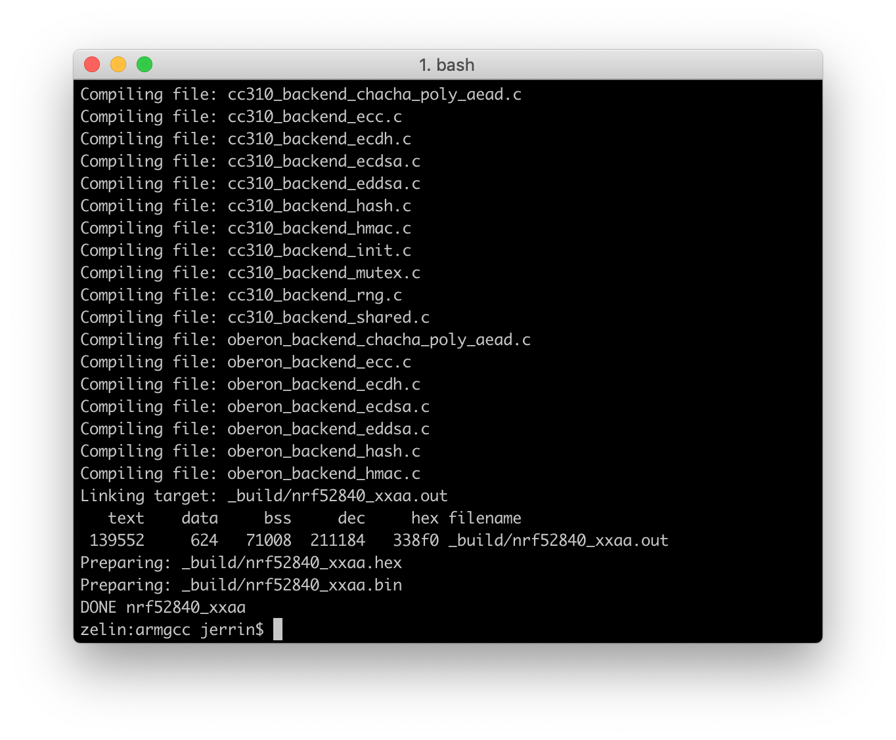

# How to build the nRF52-U2F Firmware?

This section describes how to build a new nRF52-U2F firmware and bootloader for your security key.

## Install Dependencies

To build the nRF52-U2F, you need to install some additional dependencies.

On Windows, the easiest way to install dependencies is to use the [MSYS2](http://www.msys2.org/). You can do so by performing the following steps:

1. [Download](http://www.msys2.org/) and run the installer - "x86_64" for 64-bit, "i686" for 32-bit Windows.

2. Run MSYS2 from Start menu and install dependencies with:

	``` sh
	# Update the package database and core system packages
	$ pacman -Syu

	# Install dependencies
	$ pacman -S git make python2 openssl
	```


Linux and macOS already have some necessary shell commands, run the following command to install the rest:

``` sh
# On macOS
$ brew install openssl

# On Ubuntu
$ sudo apt-get install build-essential checkinstall openssl
```

## Clone the nRF52-U2F Repository

To clone the nRF52-U2F source code repository from GitHub:

``` sh
git clone --recursive https://github.com/makerdiary/nrf52-u2f
```

## Download the nRF5 SDK

Download the SDK package from [developer.nordicsemi.com](https://developer.nordicsemi.com/).

The current version we are using is `15.2.0`, it can be downloaded directly here: [nRF5_SDK_v15.2.0_9412b96.zip](https://www.nordicsemi.com/eng/nordic/download_resource/59011/94/96002302/116085)

Extract the zip file into the `nrf52-u2f/nrf_sdks/` directory. This should give you the following folder structure:

``` info
./nrf52-u2f/
├── LICENSE.md
├── README.md
├── boards
├── certs
├── docs
├── external
├── firmware
├── include
├── material
├── mkdocs.yml
├── nrf_sdks
│   ├── README.md
│   └── nRF5_SDK_15.2.0_9412b96
├── open_bootloader
├── source
└── tools
```

## Install GNU Arm Embedded Toolchain

Download and install a [GNU ARM Embedded](https://developer.arm.com/open-source/gnu-toolchain/gnu-rm) build for your operating system and extract it on your file system.

!!! note
	The current version we are using is `6-2017-q2-update`.

Config the toolchain path in `makefile.windows` or `makefile.posix` depending on platform you are using. That is, the `.posix` should be edited if your are working on either Linux or macOS. These files are located in:

``` sh
<nRF5 SDK>/components/toolchain/gcc
```

Open the file in a text editor and make sure that the `GNU_INSTALL_ROOT` variable is pointing to your GNU Arm Embedded Toolchain install directory. For example:

``` sh
GNU_INSTALL_ROOT := $(HOME)/gcc-arm-none-eabi/gcc-arm-none-eabi-6-2017-q2-update/bin/
GNU_VERSION := 6.3.1
GNU_PREFIX := arm-none-eabi
```

## Generate Attestation Key and Certificate

For more security, remember to generate a new attestation key and certificate.

Change to the `tools` directory, run the `generate-certs.sh` to generate a new attestation key and certificate:

``` sh
$ cd ./nrf52-u2f/tools

$ ./generate-certs.sh
```

If successfully completed, the private key and certificate are stored in `certs/keys.c` file.

## Build the U2F Firmware

Now you are ready to build nRF52-U2F source code.

Open terminal and change directory to:

``` sh
# For nRF52840-MDK board
$ cd ./nrf52-u2f/boards/nrf52840-mdk/armgcc
$ make clean && make

# For nRF52840 Micro Dev Kit USB Dongle
$ cd ./nrf52-u2f/boards/nrf52840-mdk-usb-dongle/armgcc
$ make clean && make
```

The firmware is in the `armgcc/_build/` directory with the name `nrf52840_xxaa.hex`.



!!! note
	Please follow the [Upgrading Firmware](../upgrading/#upgrade-u2f-firmware-with-nrf-connet-for-desktop) guide to flash the new firmware!


## Build the Open Bootloader

The nRF52-U2F contains a reliable open bootloader, which means that you can update the nRF52-U2F firmware from USB directly without an external programmer needed. 

You can build a new bootloader by performing the following steps:

Open terminal and change directory to:

``` sh
# For nRF52840-MDK board
$ cd ./nrf52-u2f/open_bootloader/nrf52840-mdk/armgcc
$ make clean && make
$ make mergehex

# For nRF52840 Micro Dev Kit USB Dongle
$ cd ./nrf52-u2f/open_bootloader/nrf52840-mdk-usb-dongle/armgcc
$ make clean && make
$ make mergehex
```

The bootloader is in the `armgcc/_build/` directory with the name `nrf52840_xxaa_mbr.hex`.

!!! note
	Please follow the [Upgrading Firmware](../upgrading/#upgrade-open-bootloader-with-nrfutil) guide to flash the new bootloader!


## Create an Issue

Interested in contributing to this project? Want to report a bug? Feel free to click here:

<a href="https://github.com/makerdiary/nrf52-u2f/issues/new"><button data-md-color-primary="marsala"><i class="fa fa-github"></i> Create an Issue</button></a>

