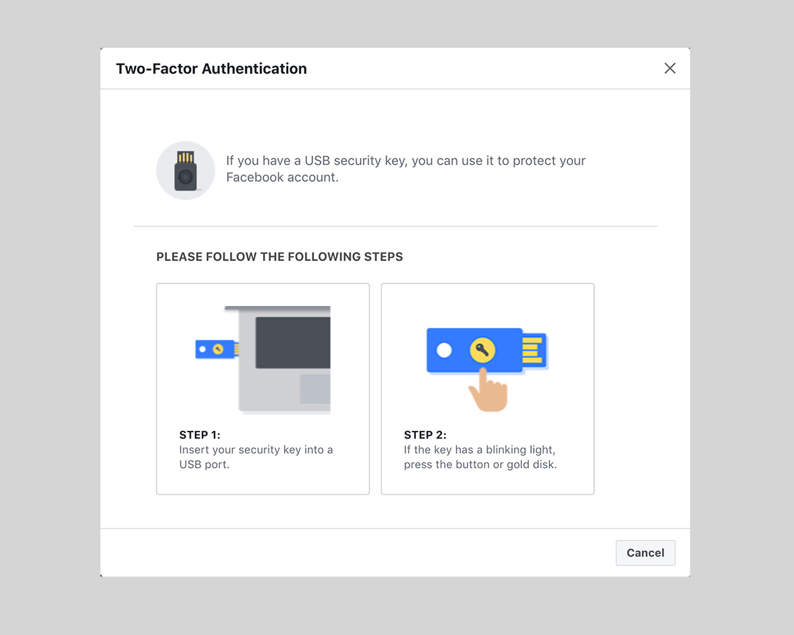
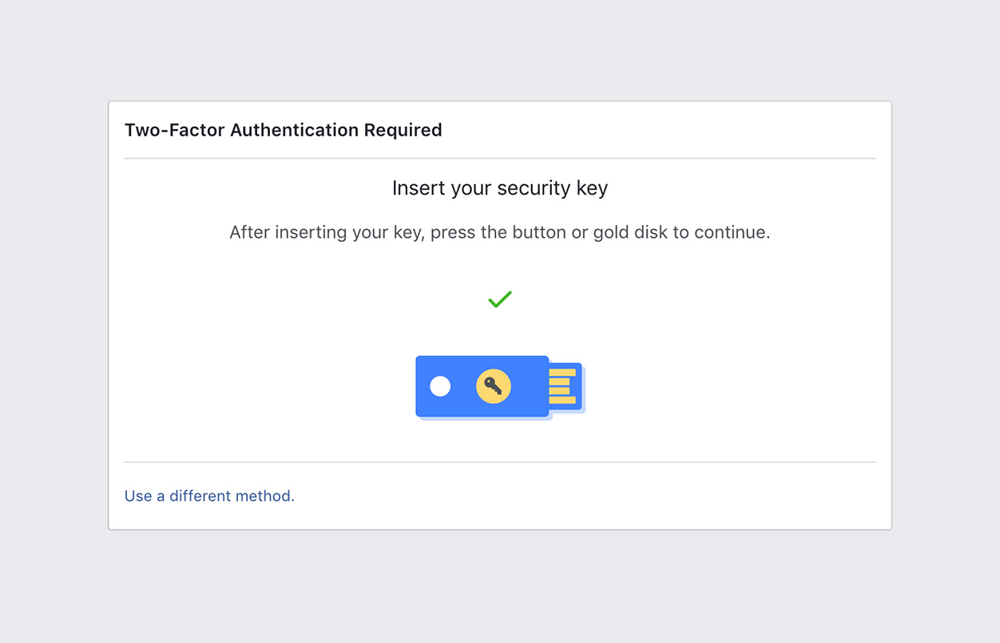

# Using nRF52 U2F Security Key with Facebook

This guide describes how to use the nRF52 U2F Security Key with Facebook.

## Requirements

* Latest version of Google Chrome browser (or at least version 38) or Opera browser

* [nRF52840-MDK](https://store.makerdiary.com/collections/frontpage/products/nrf52840-mdk-iot-development-kit) or [nRF52840 Micro Dev Kit USB Dongle](https://store.makerdiary.com/collections/frontpage/products/nrf52840-mdk-usb-dongle) with the nRF52-U2F firmware

* A Facebook Account

!!! note
	If no firmware available, please follow these guides to prepare the correct firmware: [Upgrading the firmware](../upgrading/) or [Building the firmware](../building).

## Setting Up Your Facebook Account

1. In Google Chrome or Opera, log in to [Facebook](https://www.facebook.com/).

2. Click the arrow at the top right, and then click **Settings**.

3. In the Security Settings page, in the left pane, click **Security and Login**.

4. Next to **Use two-factor authentication**, click **Edit**.

5. Click **Get Started** button to add extra security with Two-Factor Authentication.

	

6. Select **Authentication App** option, and set up an app like Google Authenticator or Duo Mobile to generate login codes.

7. Follow the instructions on the screen to finish turning on Two-Factor Authentication.

	

8. Next, you are going to add your U2F Key. Under **Add a Backup**, to the right of **Security Keys**, click **Setup**.

	

	

9. When the BLUE LED begins to blink, press the button on the key.

	

## Signing in using your key

Now you can sign in to your Facebook account with the security key you add before.

1. On your computer, [sign in to Facebook](https://www.facebook.com/). 

2. Insert your security key into the USB port.
    
	

3. When the BLUE LED begins to blink, press the button on the key.

	

**Congratulations!** You can use your key each time you sign in to your Facebook account.

## Create an Issue

Interested in contributing to this project? Want to report a bug? Feel free to click here:

<a href="https://github.com/makerdiary/nrf52-u2f/issues/new"><button data-md-color-primary="marsala"><i class="fa fa-github"></i> Create an Issue</button></a>
