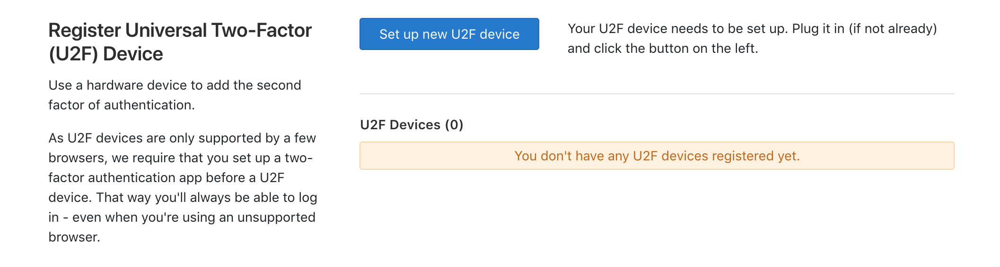
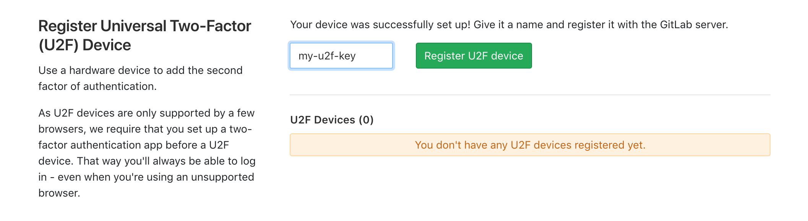

# Using nRF52 U2F Security Key with GitLab

This guide describes how to use the nRF52 U2F Security Key with GitLab.

## Requirements

* Latest version of Google Chrome browser (or at least version 38) or Opera browser

* [nRF52840-MDK](https://store.makerdiary.com/collections/frontpage/products/nrf52840-mdk-iot-development-kit) or [nRF52840 Micro Dev Kit USB Dongle](https://store.makerdiary.com/collections/frontpage/products/nrf52840-mdk-usb-dongle) with the nRF52-U2F firmware

* A GitLab Account

!!! note
	If no firmware available, please follow these guides to prepare the correct firmware: [Upgrading the firmware](../upgrading/) or [Building the firmware](../building).

## Setting Up Your GitLab Account

1. In Google Chrome or Opera, log in to [GitLab](https://gitlab.com).

2. Click the profile photo at the top right, and then click **Settings**.

3. In the **Account** page, click **Enable two-factor authentication** button.

4. Download the Google Authenticator application from App Store or Google Play Store and scan the QR code.

5. Enter the Pin code that Google Authenticator generates, and click **Register with two-factor app**.

6. In the **Account** page, click **Set up new U2F device**.

	

7. When the BLUE LED begins to blink, press the button on the key.

8. Give it a name and register it with the GitLab server.

	

9. Your device was successfully set up!

	

## Signing in using your key

Now you can sign in to your GitLab account with the security key you add before.

1. On your computer, [sign in to GitLab](https://gitlab.com/users/sign_in). 

2. Insert your security key into the USB port.
   
	

3. When the BLUE LED begins to blink, press the button on the key.

**Congratulations!** You can use your key each time you sign in to your GitLab account.

## Create an Issue

Interested in contributing to this project? Want to report a bug? Feel free to click here:

<a href="https://github.com/makerdiary/nrf52-u2f/issues/new"><button data-md-color-primary="marsala"><i class="fa fa-github"></i> Create an Issue</button></a>