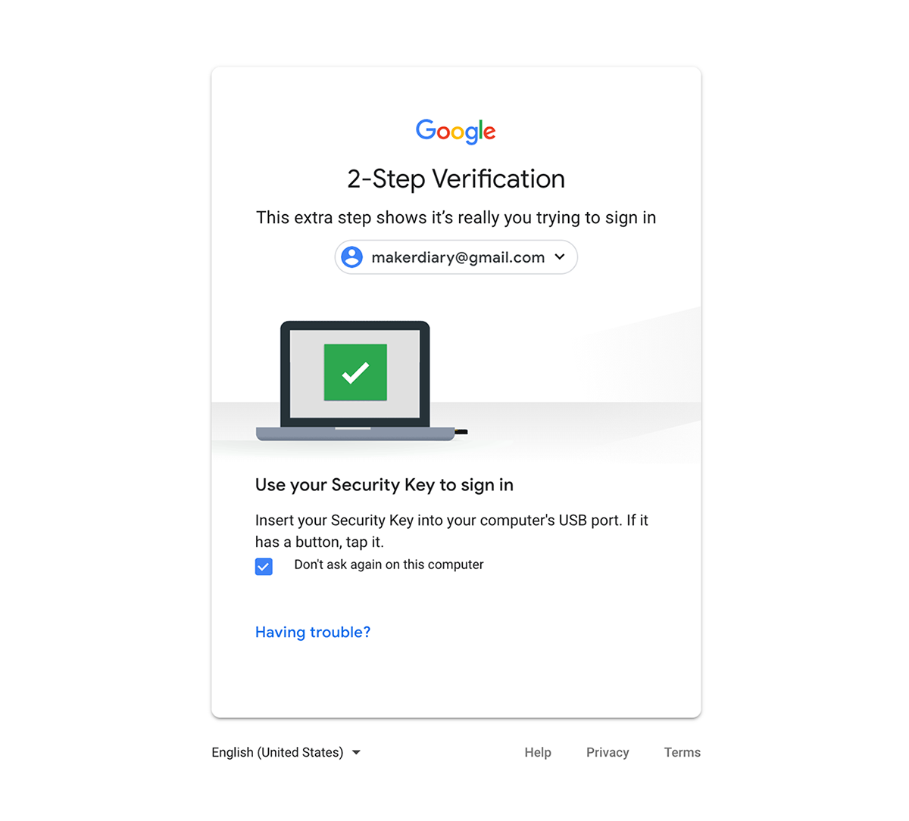

# Using nRF52 U2F Security Key with Google

This guide describes how to use the nRF52 U2F Security Key with your Google Account.

## Requirements

* Latest version of Google Chrome browser (or at least version 38) or Opera browser

* [nRF52840-MDK](https://store.makerdiary.com/collections/frontpage/products/nrf52840-mdk-iot-development-kit) or [nRF52840 Micro Dev Kit USB Dongle](https://store.makerdiary.com/collections/frontpage/products/nrf52840-mdk-usb-dongle) with the nRF52-U2F firmware

* A Google Account (such as Gmail, Google Docs, YouTube, Google+)

!!! note
	If no firmware available, please follow these guides to prepare the correct firmware: [Upgrading the firmware](../upgrading/) or [Building the firmware](../building).

## Setting Up Your Google Account

1. [Turn on 2-Step Verification](https://support.google.com/accounts/answer/9096865?hl=en&visit_id=636755555485133774-251791244&rd=1). If the 2-Step Verification is ON, continue with the next step.

2. [Add the nRF52 U2F Security Key for 2-Step Verification](https://myaccount.google.com/signinoptions/two-step-verification). On **Security Key** option, click **ADD SECURITY KEY**.

	

3. Prepare a nRF52 U2F Security Key. Insert your key into your USB port, and press the button on the key when the BLUE LED begins to blink.

	

4. Your security key is registered. Enter a name to complete this step.

	

3. Set up at least one backup option so that you can sign in even if your other second steps aren't available.

Your U2F Key is now registered to your account as your default 2-Step Verification device! 

If you accidentally lose a key, come here and remove that key from your account. No one could log in to your account, though, because they would still need to know your username and password.

## Signing in using your key

Now you can sign in to your Google Account with the security key you add before.

1. On your computer, [sign in to your Google Account](https://accounts.google.com/). Your device will detect that your account has a security key.

2. Insert your key into the USB port in your computer.
    
	

3. When the BLUE LED begins to blink, press the button on the key.

**Congratulations!** You can use your key each time you sign in to your Google Account.

## Create an Issue

Interested in contributing to this project? Want to report a bug? Feel free to click here:

<a href="https://github.com/makerdiary/nrf52-u2f/issues/new"><button data-md-color-primary="marsala"><i class="fa fa-github"></i> Create an Issue</button></a>
