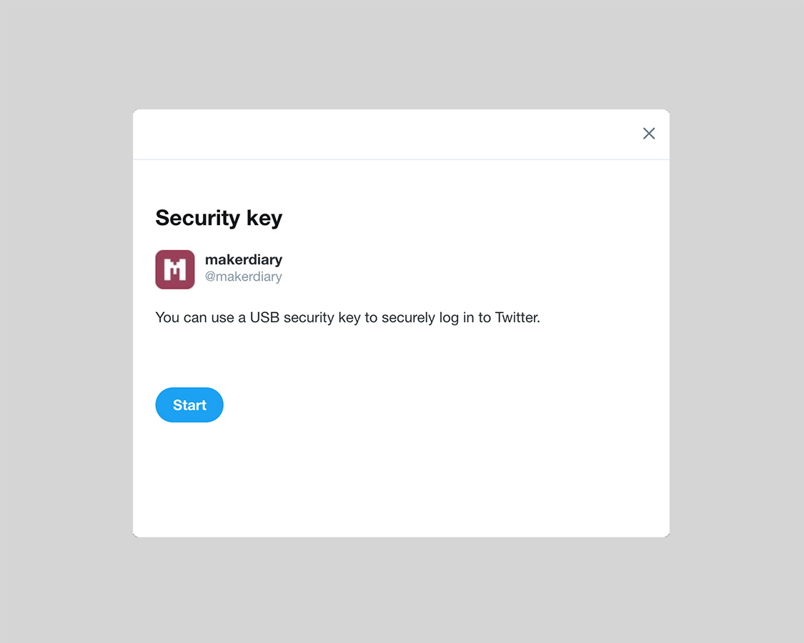
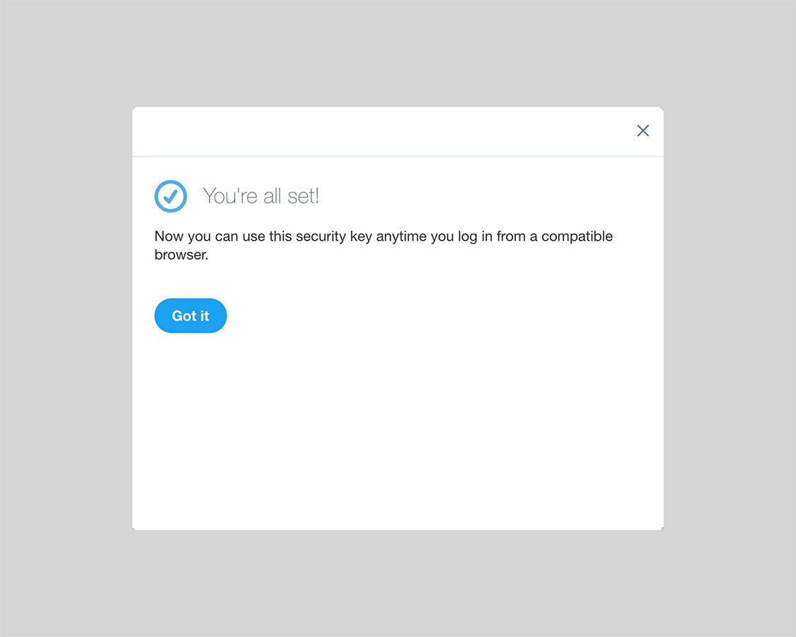
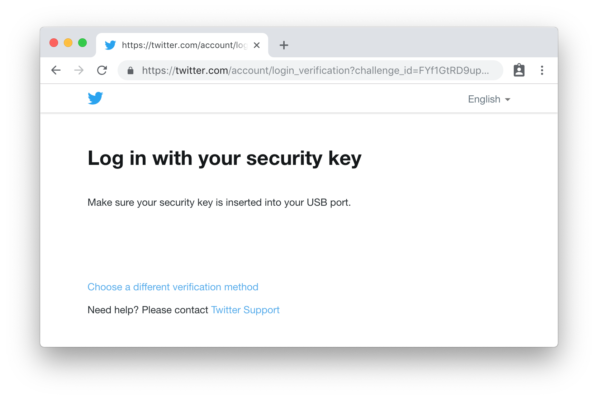

# Using nRF52 U2F Security Key with Twitter

This guide describes how to use the nRF52 U2F Security Key with Twitter.

## Requirements

* Latest version of Google Chrome browser (or at least version 38) or Opera browser

* [nRF52840-MDK](https://store.makerdiary.com/collections/frontpage/products/nrf52840-mdk-iot-development-kit) or [nRF52840 Micro Dev Kit USB Dongle](https://store.makerdiary.com/collections/frontpage/products/nrf52840-mdk-usb-dongle) with the nRF52-U2F firmware

* A Twitter Account

!!! note
	If no firmware available, please follow these guides to prepare the correct firmware: [Upgrading the firmware](../upgrading/) or [Building the firmware](../building).

## Setting Up Your Twitter Account

1. In Google Chrome or Opera, log in to [Twitter](https://twitter.com/).

2. Click the profile photo at the top right, and then click **Settings and privacy**.

3. In the **Account** page, click **Review your login verification methods** button.

4. Next to **Security key**, click **Set up**.

5. In the **Security key** window, and click **Start**

	

6. Insert your key into your USB port, and then press the button on your key.

	

7. Now that you’ve added your key to this account, let’s complete the verification — press the button on your key one more time.

	

8. Now you can use this security key anytime you log in from a compatible browser.

	

9. Set up at least one backup option so that you can sign in even if your other verification methods aren't available.

## Signing in using your key

Now you can sign in to your Twitter account with the security key you add before.

1. On your computer, [sign in to Twitter](https://twitter.com/). 

2. Insert your security key into the USB port.
    
	

3. When the BLUE LED begins to blink, press the button on the key.

**Congratulations!** You can use your key each time you sign in to your Twitter account.

## Create an Issue

Interested in contributing to this project? Want to report a bug? Feel free to click here:

<a href="https://github.com/makerdiary/nrf52-u2f/issues/new"><button data-md-color-primary="marsala"><i class="fa fa-github"></i> Create an Issue</button></a>