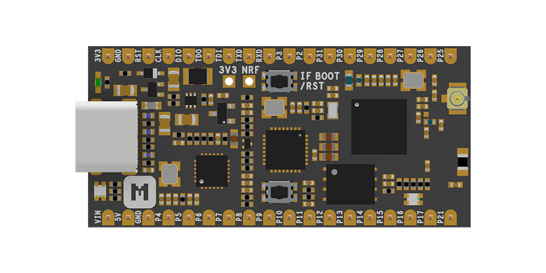

# nRF52 FIDO U2F Security Key  <small>An Open-Source FIDO U2F implementation on nRF52 SoC</small>

## Description

nRF52-U2F is an open-source FIDO U2F implementation on nRF52 SoC. Taking advantage of Nordic’s powerful SoC [nRF52840](https://www.nordicsemi.com/eng/Products/nRF52840) and [nRF5 SDK](https://www.nordicsemi.com/eng/Products/Bluetooth-low-energy/nRF5-SDK), it's quite easy to make a FIDO U2F key with a number of distinguishing features, such as USB HID class modules, comprehensive cryptography library with ARM® TrustZone® Cryptocell-310, reliable Device Firmware Update (DFU), etc.

The FIDO Universal 2nd Factor (U2F) is an open authentication standard that allows online services to augment the security of their existing password infrastructure by adding a strong second factor to user login. 

During registration and authentication, the user presents the second factor by simply pressing a button on a FIDO U2F key. The user can use their FIDO U2F key across all online services that support the protocol leveraging built-in support in web browsers.

FIDO U2F has been successfully deployed by large scale online services, including [Google](guides/using-u2f-with-google), [Facebook](guides/using-u2f-with-facebook), [Twitter](guides/using-u2f-with-twitter), [GitHub](guides/using-u2f-with-github), [GitLab](guides/using-u2f-with-gitlab), and many more.

The FIDO U2F technical specifications are hosted by the open-authentication industry consortium known as the [FIDO Alliance](http://fidoalliance.org/). Learn more about U2F on https://fidoalliance.org/.

## Features

* Support Nordic nRF52840 System-on-Chip
	- ARM® Cortex®-M4F processor optimized for ultra-low power operation
	- Combining *Bluetooth 5*, *Bluetooth Mesh*, *Thread*, *IEEE 802.15.4*, *ANT* and *2.4GHz*
	- On-chip NFC-A tag
	- On-chip USB 2.0 (Full speed) controller
	- ARM TrustZone® Cryptocell-310 security subsystem
	- 1 MB FLASH and 256 KB RAM

* Standard FIDO U2F Protocol supported
* Driver-less installation on all major host platforms
* Multi-application support with concurrent application access without the need for serialization and centralized dispatching.
* Comprehensive cryptography library with ARM® TrustZone® Cryptocell-310
* Reliable Device Firmware Update (DFU)

## How it works?

The following diagram explains the basic process flow of FIDO U2F:

## Supported Boards

The following developmet boards are supported well and it's easy to port to other nRF52840 boards. More boards are planned and will show up gradually over time.

| **nRF52840-MDK** | **nRF52840 Micro Dev Kit USB Dongle** |
|:---:|:---:|
|  <a href="https://store.makerdiary.com/collections/frontpage/products/nrf52840-mdk-iot-development-kit"><button data-md-color-primary="marsala">Get One!</button></a> |  <a href="https://store.makerdiary.com/collections/frontpage/products/nrf52840-mdk-usb-dongle"><button data-md-color-primary="marsala">Get One!</button></a> |

## Supported Services

There are a list of featured services that use FIDO U2F. More services will deploy U2F and will show up here over time.

| **Service** |             |            |             |
| ----------- | ----------- |----------- | ----------- |
| [Google](guides/using-u2f-with-google) | [Facebook](guides/using-u2f-with-facebook) | [Twitter](guides/using-u2f-with-twitter) | [GitHub](guides/using-u2f-with-github) |
| [GitLab](guides/using-u2f-with-gitlab) | [yubico demo](https://demo.yubico.com/u2f) | | |

## Reference

* [FIDO U2F Specifications](https://fidoalliance.org/download/)
* [makerdiary/nrf52-u2f](https://github.com/makerdiary/nrf52-u2f)
* [nRF52840-MDK Docs](../nrf52840-mdk/)
* [nRF52840 Micro Dev Kit USB Dongle Docs](../nrf52840-mdk-usb-dongle/)
* [More about nRF52840](https://www.nordicsemi.com/eng/Products/nRF52840)

## Create an Issue

Interested in contributing to this project? Want to report a bug? Feel free to click here:

<a href="https://github.com/makerdiary/nrf52-u2f/issues/new"><button data-md-color-primary="marsala"><i class="fa fa-github"></i> Create an Issue</button></a>

