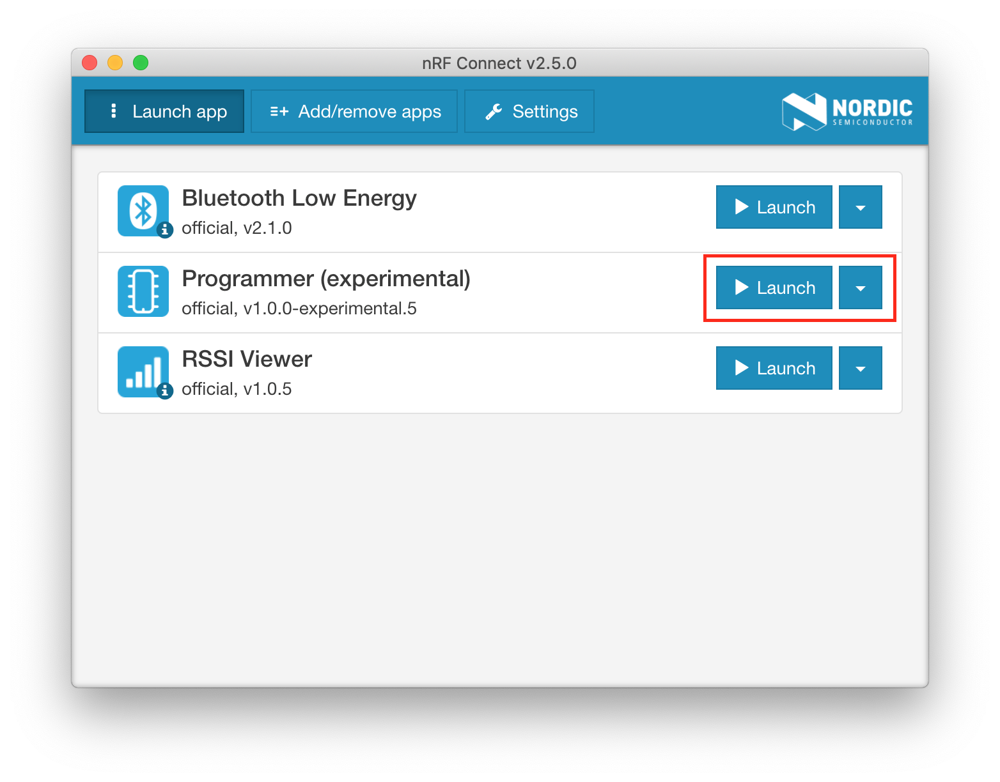

# How to upgrade the nRF52-U2F Firmware?

This guide details how to upgrade the nRF52-U2F firmware and the open bootloader.

The nRF52 U2F Security Key contains an Open Bootloader with Device Firmware Update (DFU) functionality. You can easily upgrade the firmware using the following tools:

* [nRF Connet for Desktop](https://www.nordicsemi.com/eng/Products/Bluetooth-low-energy/nRF-Connect-for-Desktop)
* [nrfutil](https://github.com/NordicSemiconductor/pc-nrfutil/) from the command line.

## Get the latest pre-built firmware

You can get the latest pre-built firmware from the following table, where the `.hex` file is used with **nRF Connet for Desktop** and `.zip` package is used with **nrfutil** tool.

| **Board** | **nRF52840-MDK** | **nRF52840 Micro Dev Kit USB Dongle** |
| :---------: | ----------- |----------- |
| **Bootloader** | [nrf52_u2f_bootloader_vx.x.x_mdk.hex](https://github.com/makerdiary/nrf52-u2f/tree/master/firmware/nrf52840-mdk/Bootloader/)<br/>[nrf52_u2f_bootloader_vx.x.x_mdk.zip](https://github.com/makerdiary/nrf52-u2f/tree/master/firmware/nrf52840-mdk/Bootloader/) | [nrf52_u2f_bootloader_vx.x.x_mdk_dongle.zip](https://github.com/makerdiary/nrf52-u2f/tree/master/firmware/nrf52840-mdk-usb-dongle/Bootloader/) |
| **Application** | [nrf52_u2f_app_vx.x.x_mdk.hex](https://github.com/makerdiary/nrf52-u2f/tree/master/firmware/nrf52840-mdk/App/)<br/>[nrf52_u2f_app_vx.x.x_mdk.zip](https://github.com/makerdiary/nrf52-u2f/tree/master/firmware/nrf52840-mdk/App/) | [nrf52_u2f_app_vx.x.x_mdk_dongle.hex](https://github.com/makerdiary/nrf52-u2f/tree/master/firmware/nrf52840-mdk-usb-dongle/App/)<br/>[nrf52_u2f_app_vx.x.x_mdk_dongle.zip](https://github.com/makerdiary/nrf52-u2f/tree/master/firmware/nrf52840-mdk-usb-dongle/App/) |


## Upgrade U2F Firmware with nRF Connet for Desktop

To update the device, it must be in bootloader mode.

While holding the dongle's RESET/USR button, connect it to your computer. When the device has entered the bootloader mode, the RGB LED pulses RED. The device is now ready for programming.

Launch *Programmer* app from nRF Connect for Desktop, you can find the device and select it to start programming.



Add an application file `nrf52_u2f_app_vx.x.x_mdk.hex`(for nRF52840-MDK) or `nrf52_u2f_app_vx.x.x_mdk_dongle.hex`(for nRF52840 Micro Dev Kit USB Dongle), you will see the memory layout of the HEX file, and then write it into the device.


After programming, please physically re-plug the device. The new firmware should work as expected.

## Upgrade U2F Firmware with nrfutil

[nrfutil](https://github.com/NordicSemiconductor/pc-nrfutil) is a Python package and command-line utility that supports Device Firmware Updates (DFU) and cryptographic functionality.

To install the latest published version from the Python Package Index simply type:

``` sh
pip install nrfutil
```

To update the device, it must be in bootloader mode.

While holding the dongle's RESET/USR button, connect it to your computer. When the device has entered the bootloader mode, the RGB LED pulses RED. The device is now ready for programming.

Run the following command to upgrade the U2F firmware, where:

* `<package-path>` is the filename of the DFU package (e.g. `nrf52_u2f_app_v1.0.0_mdk_dongle.zip`).

* `<serial-port>` is the serial port address to which the device is connected. (e.g. `COM1` in windows systems, `/dev/ttyACM0` in linux/mac).

``` sh
nrfutil dfu usb_serial -pkg <package-path> -p <serial-port>
```


## Upgrade Open Bootloader with nrfutil

To update the bootloader, the device must be in bootloader mode.

While holding the dongle's RESET/USR button, connect it to your computer. When the device has entered the bootloader mode, the RGB LED pulses RED. The device is now ready for programming.

Run the following command to upgrade the bootloader, where:

* `<bootloader-path>` is the filename of the Bootloader package (e.g. `nrf52_u2f_bootloader_v1.0.0_mdk_dongle.zip`).

* `<serial-port>` is the serial port address to which the device is connected. (e.g. `COM1` in windows systems, `/dev/ttyACM0` in linux/mac).

``` sh
nrfutil dfu usb_serial -pkg <bootloader-path> -p <serial-port>
```


## Create an Issue

Interested in contributing to this project? Want to report a bug? Feel free to click here:

<a href="https://github.com/makerdiary/nrf52-u2f/issues/new"><button data-md-color-primary="marsala"><i class="fa fa-github"></i> Create an Issue</button></a>

